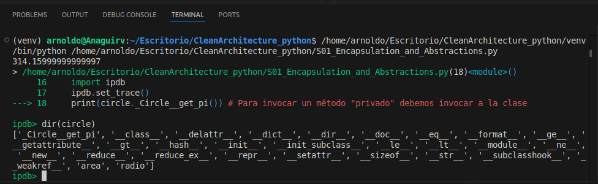

# Encapsulamiento
Uno de los pilares de la POO, se utiliza para ocultar los detalles de implementación y exponer únicamente la funcionalidad o atributos que el usuario requiere, ocultando los detalles internos de la logica requerida para generar el comportamiento o restringir los datos a los que se tiene acceso. Su objetivo es ocultar la complejidad y exponer únicamente lo esecial para el usuario.

```python
class Circle:
    
    def __init__(self, radio: float):
        self.radio = radio

    def __get_pi(self):
        return 3.1416
    
    def area(self):
        return self.__get_pi() * self.radio ** 2
    
if __name__ == '__main__':
    circle = Circle(10)
    print(circle.area())

    print(circle._Circle__get_pi())
```
Python simula un método privado agregando un doble guion bajo en el nombre, como por ejemplo  **__get_pi(self)** y esto hace que no este disponible para ser invocado por el usuario, aunque en realidad como python solo simula la protección y privacidad, se puede acceder igualmente a el indicando el nombre de clase y metodo al cual se quiere acceder, como se realiza en **print(circle._Circle__get_pi())**. 

Podemos utilizar herramientas como **ipdb** para debuguear el codigo y detenernos en las lineas que nos interese para comprender el estado de sistema en un punto dado.

[**ir a la web de ipdb**](https://pypi.org/project/ipdb/)
```
pip install ipdb

```
Podemos importar esta libreria y ocupar el método **ipdb.set_tracer()** para detener la ejecución del código en una linea especifica y explorar el estado de las variables hasta ese momento.

Por ejemplo, invocamos al método **ipdb.set_tracer()** en la linea 17 y la ejecución del código se detiene en la linea siguiente, pudiento utilizar el comando **dir(nombre_objeto)** "dir(circle)" en nuestro caso para inspeccionar todos los metodos a los que podremos acceder de dicho objeto.

 

Desde acá podemos acceder a los método del objeto o presionar "c" para continuar con la ejecución del programa.

## ¿Qué hace if __name__ == "__main__":?
Permite **ejecutar código solo cuando el archivo se corre directamente**, y **no** cuando se importa como módulo en otro archivo.

```py
# archivo: ejemplo.py

def saludar():
    print("Hola desde la función saludar")

if __name__ == "__main__":
    print("Ejecutando ejemplo.py directamente")
    saludar()

```
### Resultado al ejecutar directamente:
```bash
$ python ejemplo.py
Ejecutando ejemplo.py directamente
Hola desde la función saludar

```
### Resultado si se importa:
```py
# archivo: otro.py
import ejemplo

# No se imprime nada de la parte bajo if __name__ == "__main__"
```

### ¿Por qué es útil?
1. Separación de responsabilidades
    - Permite definir funciones, clases y lógica reutilizable sin ejecutar código accidentalmente al importar.

2. Pruebas rápidas
   - Puedes incluir tests o código de prueba sin afectar a otros módulos que usen tu archivo.

3. Punto de entrada
   - Funciona como el "main" de otros lenguajes como Java o C.

## Recomendación (estilo profesional)
Cuando desarrolles módulos en proyectos más grandes (como con Cosmic Python), siempre incluye esta estructura al final:
```py
def main():
    # Lógica principal del script
    ...

if __name__ == "__main__":
    main()

```
Esto **mejora la organización** y **facilita el testing**.

